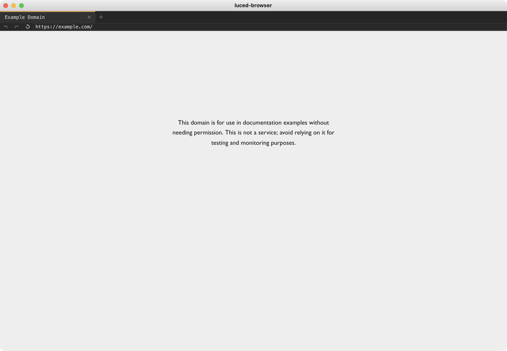

# luced-browser

A web browser written in Luce, over the
[luce-browser engine](https://github.com/dymokomi/luce-browser-engine): Ladybird's LibWeb
ported to Luce Base. It has the look of [luced-2d](https://github.com/dymokomi/luced-2d):
brutalist, grey, one orange (#E7A03F), square.



## What it does

- Tabs, a toolbar (back, forward, reload or stop, the address field) and a loading bar.
- The address field takes a URL (`https:`, `http:`, `file:`, `data:`, `about:`), a file path,
  a host (`ladybird.org` gets `https://`), or else searches DuckDuckGo, as Ladybird's
  `sanitize_url` decides.
- Pages render as the engine renders them (CSS, SVG, images, web fonts) at the window's
  device pixel ratio, scroll with the wheel, the trackpad and the keys, follow links, show the
  page's cursor, and keep a session history. A drag selects text (a double click a word, a
  triple click a paragraph); Cmd/Ctrl+C copies it.
- JavaScript is not run yet: pages load with scripting disabled (the engine's phase 3).

Shortcuts (Cmd on macOS, Ctrl elsewhere): L the address field, R reload, `.` stop,
`[` and `]` back and forward, T a new tab, W close it, Shift+`[` and Shift+`]` the tabs
around, C copy, A select all.

## Running

```sh
luc run -- https://example.com
```

The first argument is a location to open; without one the browser opens a new tab. The
engine writes the resources it reads (its error and directory pages) under
`~/.luce/luced-browser/res`.

## How it is built

The application (`src/*.luc`) is Luce: the window, toolbar, tabs, commands and the loop that
runs the engine each turn. Everything that scales with a page stays in Base, one call per
frame or event: the engine's `webview` module (Ladybird's LibWebView and WebContent, in
process) and `src/engine_hooks.lucb` (the frame's texture, key codes, the engine's wake-up
of the window's loop).

## Tests

```sh
./test.sh               # formatting, then the headless tests (no window, the engine for real)
./test.sh --diagnostic  # the same in the diagnostic profile
```

The headless tests drive the browser through luce-ui's `dispatch` and `render`: typing an
address and Enter, a click on a link, the back and forward buttons, the shortcuts, tabs, a
drag that selects text.

MIT or Apache-2.0, at your option.
